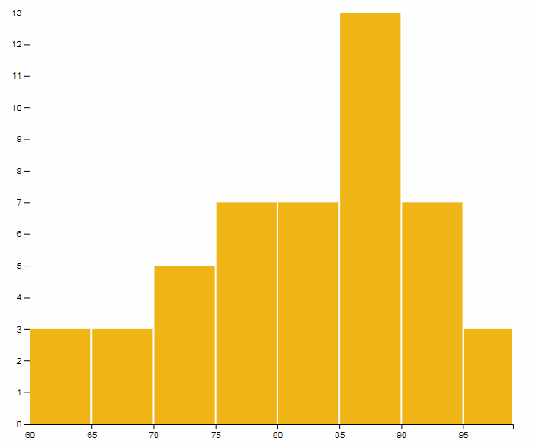
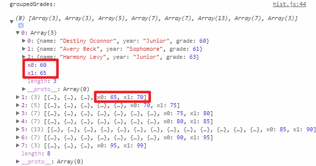

## Notes on d3.histogram()

In this example we create a histogram with `d3.histogram()`, and here we will try our best to make sense of doing it this way. 

We have the exam grades of 50 students, represented in the format that we should be all familiar with by now:
``` JavaScript
[
      {name: "Destiny Oconnor", year: "Junior", grade: 60},
      {name: "Avery Beck", year: "Sophomore", grade: 61},
      {name: "Harmony Levy", year: "Junior", grade: 63},
      ...
]
```
Now someone asked for the grade distribution on Piazza and we want to create a histogram with d3 like the following, with each bar representing the number of students in the bin:



Consider how we would approach the task here. Given what we have done in the course, you might immediately recognize that the histogram is nothing more than a bar chart, and we know how to create the bar chart from an array of data points (by binding the array to a selection and then append `rect` elements to it). The only other thing we need to do is to get the right data: the count of students in each bin (60-65, 66-70, ...).

With that in mind, we quickly write some plain Javascript to iterate through the data, count the number of students in each bin, and store them in an array:
``` JavaScript
counts = [3,3,5,7,8,14,7,3]
```
We can then go ahead and use this data to create the bar chart! But this is a bit awkward since we need to position the bars along the x-axis with the *index* of each data point instead of the actual grade values. But we can easily improve that by changing our code a little, and incorporating the information about the bins themselves into our data: 
``` JavaScript		
counts = [ 
           {low: 60, high: 65, count: 3},
           {low: 65, high: 70, count: 3},
           {low: 70, high: 75, count: 5},
           ...
         ]
```
This way, we can use the actual endpoints with the x-axis's scale to position the bars.

We now have a pretty good solution to create the histogram. But the problem is: what if our requirement changes? What if, instead of using count, we want to represent each student with a circle, stack all of them in the bin, and also use colors to represent their year? This is very similar to what we need to do in Homework 4, and our current solution does not generalize well to solve that problem because our data only include the total count and not the actual grades or years of each students. 

Well, how about we just store the complete student information instead of just the counts? We change our code again and format the data into a nested data structure like this:
``` JavaScript		
groupedGrades = [
  { 
    low: 60, 
    high: 65, 
    students: [
      {name: "Destiny Oconnor", year: "Junior", grade: 60},
      {name: "Avery Beck", year: "Sophomore", grade: 61},
      {name: "Harmony Levy", year: "Junior", grade: 63},
    ]
  },
  { 
    low: 65, 
    high: 70, 
    students: [
      {name: "Xander Greene", year: "Sophomore", grade: 65},
      {name: "Pedro Townsend", year: "Junior", grade: 69},
      {name: "Kiley Blankenship", year: "Junior", grade: 69},
    ]
  },
  ...
]
```
If we just want the simple bar chart that represent the counts, we can use the length of the array storing all students data in each bin. This is exactly what we do in the example. Using the nested data structure above is arguably an overkill when we just need the counts, but it makes things much easier when we actually need to represent the individual students in the histogram.

You may have recognized that this format of data looks very similar to the nested data you created with `d3.nest()` in [**Lab 5**](https://github.gatech.edu/CS4460-Spring2018/Labs/tree/master/05_lab) (stock prices grouped by company) and in [**HW2**](https://github.gatech.edu/CS4460-Spring2018/Homework/tree/master/02_trellis_scatterplot) (rental prices grouped by city). You are right. The only difference is that instead of grouping the data by the different value of company or city, we group the data into ranges or bins by their grade.

Now being good engineers and realizing that grouping the original data into the nested format above is very useful in general, we abstract it into a method like `d3.nest()`. The method lets us specify which attribute to look at when grouping the data and how the bins are divided, and we can use it to group our data whenever we need a histogram. Congratualtions. We just reinvented `d3.histogram()`.

So generally speaking, `d3.histogram()` actually does same thing as `d3.nest()`. Despite of its name it does not create the histogram for you. Instead it transforms the data, by grouping the data points in the way you specify, and creates a nested data structure that you can later use to plot the histogram.

### d3.histogram() in our example

Let's look at how we used d3.histogram() in our example: 

```JavaScript
  // Compute range of grades, which is [61, 99]
  var gradeExtent = d3.extent(data, function(d) { return d.grade; }); 

  // Create a scale to map the domain [61, 99] to pixel values
  // It will be used for both positioning the bars and create the axis
  var xScale = d3.scaleLinear().range([0, width]).domain(gradeExtent);

  // Nothing new above

  // Now we use d3.histogram() to set up our data transformation
  var groupDataIntoBins = d3.histogram()
                            .value(function(d) { return d.grade; }) // tell d3 to group data by grades
                            .domain(xScale.domain()) // only include data within [61, 99], anything outside will be ignored 
                            .thresholds(xScale.ticks(10)); // create about 10 ticks for xScale, and use the tick values as endpoints for bins.
                            // It turns out the ticks created are [60, 65, 70, ...]

  // apply the data-transformation function we just set up to the actual data to group the data.
  var groupedGrades = groupDataIntoBins(data); 

  console.log('groupedGrades: ', groupedGrades); // check this out in the console!
```

The nested data `groupedGrades` we get is slightly different from the one use discussed above. Check it out in the console:



The nested data we get is an array of arrays (instead of array of objects), each inner array contains data for all students in the bin. 
``` JavaScript	
    console.log('students in the first bin: ', groupedGrades[0]); // An array of 3 students
```
But each inner array also has two extra field called `x0` and `x1`. These are exactly the lower and upper bound of the bin (what we call `low` and `high` earlier), and you can access them like accessing the field in a ordinary object:
``` JavaScript    
    console.log('range of the first bin: ', groupedGrades[0].x0, 'to', groupedGrades[0].x1); // 60 to 65
```

### the homework

In your homework, you can group the data with d3.histogram() exactly like what we did above, and you will then actually use the individual city data points nested inside to create the circles. The way you create such a graph with nested data to create is again very similar to how you use the nested data produced by d3.nest() in [**Lab 5**](https://github.gatech.edu/CS4460-Spring2018/Labs/tree/master/05_lab) and [**HW2**](https://github.gatech.edu/CS4460-Spring2018/Homework/tree/master/02_trellis_scatterplot): Using **grouping** and **nested selection**. Recall that when creating the trellis plot in HW2, we created multiple subplots and threw different circles into different subplots. Here you just need to create the bins and throw circles into their corresponding bins. There is nothing conceptually new.

Hopefully you now have a more intuitive understanding of d3.histogram(). If you need strict descriptions of its behavior, the [official document](https://github.com/d3/d3-array#histograms) is still the best resource despite of being very concise.
