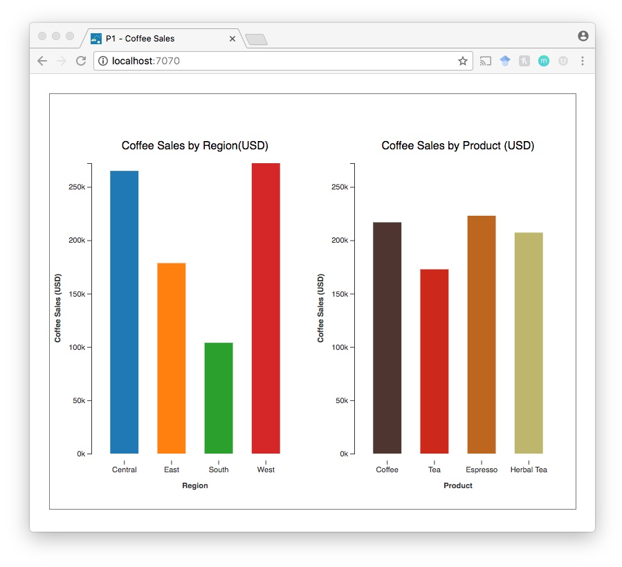

# CS 4460 - Information Visualization

***

# Programming Assignment 1: Static Bar Chart

### Instructions

In this assignment you will create two bar charts on the same web page. The bar charts show the **total coffee sales** for a chain of coffee shops. Your submission should create a web page that looks like this:

The first bar chart shows the total sales per **region** (i.e. Central, West, East, South). The second bar chart shows the total sales per product **category** (i.e. Coffee, Tea, Espresso, Herbal Tea).

You will use the dataset at `./data/coffee_data.csv` to create both of these charts. The data looks like this:

| date   | sales | region  | state | category | type        | caffeination |
|--------|-------|---------|-------|----------|-------------|--------------|
| 1/1/10 | 219   | Central | CO    | Coffee   | Amaretto    | Regular      |
| 1/1/10 | 134   | Central | CO    | Espresso | Caffe Mocha | Regular      |
| 1/1/10 | 130   | West    | WA    | Coffee   | Columbian   | Regular      |
| 2/1/10 | 43    | East    | NH    | Tea      | Green Tea   | Regular      |

Notice, that this dataset is not in the form that you will need. You will need to aggregate the data for the `region` and `category` data attributes and then compute the total sales. For this assignment, you are **required to accompish this with JavaScript** code (the [d3-nest function](http://learnjsdata.com/group_data.html) is a great place to start). **Do not use Excel, Python, etc. to create the aggregated dataset.**

> Reminder that this is an individual assignment. The code you turn in should be your own creation. You are certainly welcome to seek assistance from the TAs as you work on the assignment, however.

### Starter code

All of the starter code for the Programming Assignments can be found at the [HW Github Repository](https://github.gatech.edu/CS4460-Spring2018/Homework). `git clone` this repository for this assignments starter code. You will need to `git pull` for all future starter code.

**You are required to use the starter code for all programming assignments.**

### What to turn in

You will submit your code via T-Square. Compress your code (the `01_bar_chart` directory) into a zip file. Upload and submit this zip file via T-Square.

### Grading

P1 will be graded out of a 100 point scale. If your D3 code does all of the following you will receive all 100 points:

1. Creates 2 bar charts that show the required data from the instructions (1 chart for regional sales, 1 chart for sales by product category) - we will check to make sure the bar charts are data accurate.
2. Your code processes the raw data (all of the sales data rows) to create a data structure for the 2 charts - d3.nest() is a good place to look - you will lose points if your JavaScript code does not process the data and you instead used another tool such as Excel to create an aggregated dataset file.
3. You are required to add labels and axes for both charts.

*You will not be graded on any of the following:*

1. The styling of the charts, axes or labels
2. The colors you decide to use
3. The spacing or width of the bars
4. Conventions or legible D3 code
