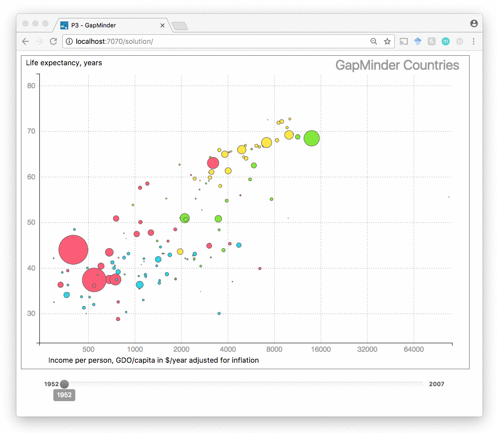
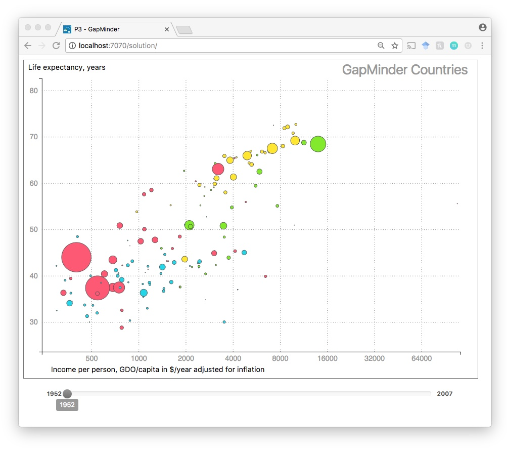

**Due Sunday, April 1st, 11:55 pm**

CS 4460 - Information Visualization - Fall 2017

***

# Programming Assignment 3: Sliding GapMinder

### Instructions

In this assignment you will create a version of the bubble chart from [Hans Rosling's GapMinder storytelling video](https://www.ted.com/talks/hans_rosling_at_state). The bubble chart shows 142 countries. The chart shows the life expectancy compared to the GDP per capita for each country. An interactive version of the tool can be found on the [GapMinder website](http://www.gapminder.org/tools/#_chart-type=bubbles).

Your chart will be interactive. It must update to show the data for each 5-year interval. We have already added a slider that will control the current year for the chart. Your submission should update with the slider as seen below:

The slider will call the method `updateChart(year)` where `year` is one of the 5-year intervals from the dataset. It is your job to update your chart within this method.

You will use the dataset at `./data/gapminder.csv` to re-create the GapMinder bubble chart. Here is a snippet of the dataset:

| `country`      |`year`|`population`|`continent` |`lifeExp`|`gdpPercap`  |
|----------------|------|------------|------------|---------|-------------|
| Afghanistan    | 2002 | 25268405   | Asia       | 42.129  | 726.7340548 |
| Afghanistan    | 2007 | 31889923   | Asia       | 43.828  | 974.5803384 |
| United Kingdom | 1977 | 56179000   | Europe     | 72.76   | 17428.74846 |
| United Kingdom | 1982 | 56339704   | Europe     | 74.04   | 18232.42452 |
| Madagascar     | 2002 | 16473477   | Africa     | 57.286  | 894.6370822 |
| Madagascar     | 2007 | 19167654   | Africa     | 59.443  | 894.6370822 |

* `country` (`string`) - the name of the country
* `year` (`number`) - the year for that recording, spans from 1952 to 2007 in **5-year intervals**
* `population` (`number`) - the total population for that year
* `lifeExp` (`number`) - the mean life expectancy for that year
* `gdpPercap` (`number`) - the income per person, or GDP per capita in USD adjusted for inflation for that year

You will use this dataset to create the above interactive bubble chart.

The data-bindings on the bubbles are:
* x-positon - `gdpPercap` in a `scaleLog`
* y-positon - `lifeExp` in a `scaleLinear`
* radius - `population` in a `scaleSqrt`
* fill color - `continent` (we have provided the color map as `contintentColors`)

First, you will need to group or nest the dataset by the `year` data attribute. This data re-configuration is slightly different - you want to access all 142 countries for each year so making a key-value array with `d3.nest().entries()` might not be the best method.

Unlike [P2](https://github.gatech.edu/CS4460-Spring2018/Homework/tree/master/02_trellis_scatterplot) you **are not required** to use the `d3.nest()` function.

You will create this interactive chart using D3's Enter, Update, Exit pattern. Look to [Lab 6](https://github.gatech.edu/CS4460-Spring2018/Labs/wiki/Lab-6:-D3-Enter,-Update-&-Exit-(Pre-Lab)) where we covered how to add, update, and remove elements with D3.

> Reminder that this is an individual assignment. The code you turn in should be your own creation. You are certainly welcome to seek assistance from the TAs as you work on the assignment, however.

### Starter code

All of the starter code for the Programming Assignments can be found at the [HW Github Repository](https://github.gatech.edu/CS4460-Spring2018/Homework). `git clone` this repository for this assignments starter code. You will need to `git pull` for all future starter code.

**You are required to use the starter code for all programming assignments.**

### What to turn in

You will submit your code via T-Square. Compress your code (the `03_gapminder` directory) into a zip file. Upload and submit this zip file via T-Square.

### Deadline

Your zipped code should be submitted to T-Square by **11:55 pm on Sunday, April 1st**

### Grading

This assignment will be graded out of a 100 point scale. If your D3 code does all of the following you will receive all 100 points:

1. Creates a bubble chart with the above visual to data mappings for each circle representing a country.
2. The chart updates with the appropriate yearly data on `updateChart(year)`. **You are required to use the Enter, Update, Exit D3 pattern. Points will be deducted** if your code removes all circles and then re-appends new circles on every `updateChart()` call. Your code should use [object constancy](https://bost.ocks.org/mike/constancy/) per country.
3. You are required to add a title, labels, axes and gridlines to the chart.

You will not **lose points** on any of the following:

1. The styling of the chart, grids, axes or labels
2. The number of ticks or grid lines
3. Conventions or legibility of your code
4. Handling any other datasets than `./data/gapminder.csv`

**Extra Credit (upto 10 points)**

1. Add a tooltip to each of the country bubbles. It should display the `country`, `lifeExp` and `gdpPercap`. **(5 points)**
2. Create a dropdown menu which contains all the continents (Asia, Europe, Africa, Americas). On selection of an item from the dropdown, the chart must display bubbles belonging to that continent. The dropdown must also contain an option 'All' which displays all the continents. **(5 points)**
